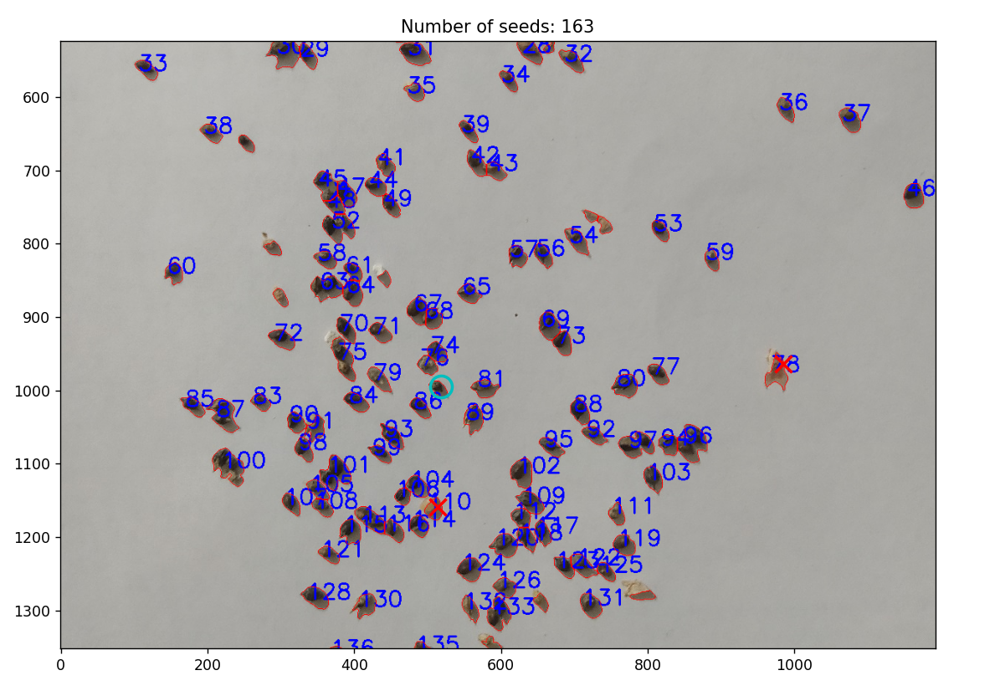

# Ambrosia seeds counting tool
A program for those who are tired of counting 
the amount of ambrosia in grain or shroud samples. 
Keep your sight - just take a picture 
of the small fraction and run this program.

## Requirements
* Python 3.9 or above
    
## Setup
Create and activate a new python venv. Then run:

```bash
pip install -r requirements.txt
```

## Usage
Specify the path to image, using this simple CLI:

```bash
python ambrosia.py -f "path to image"
```

Watershed algorythm is fast, but not ideal.
This program automatically excludes 
too small objects from counting. 
Clusters of dark seeds are calculated by the following rule:

```
cluster_area / median_area
```

However, large and dense clusters with poor lighting can overstate the amount of seeds - avoid them if possible.



You can manually select seeds that for some reason 
were not added by the program, 
double-clicking with the left mouse button, 
and cross off false positives, 
double-clicking with the right mouse button.
Also, you can use the toolbar for navigation 
and saving the image.
